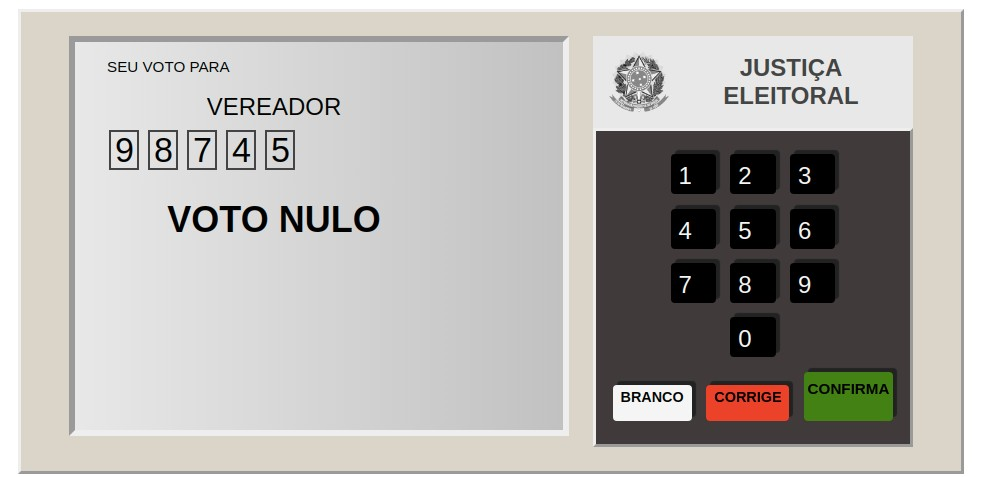

# Trabalho Final - Urna Eletrônica
## Alunas
- Carla Moreno Barbosa | DRE: 117250502
- Rebeca Batista Medeiros da Fonseca | DRE: 114156733

## Descrição
Implementação do backend em PHP/MySQL para o projeto da Urna Eletrônica.

## Documentação
O projeto utiliza uma documentação completa composta por: jsdoc para o código javascript e Doxygen para o código PHP.
- Documentação jsdoc disponível acessando ```out/index.html```
- Documentação Doxygen disponível acessando ```doc/html/index.html```

Segue imagem do simulador da urna eletrônica brasileira utilizado:


## Como visualizar o trabalho
1. Coloque todos esses arquivos para servir em um servidor apache.
2. O banco deve ser populado com o conteúdo do arquivo ```tabelasEDados.sql```
3. Em seguida, altere para os do banco que está utilizando em ```php/conexao.php```
